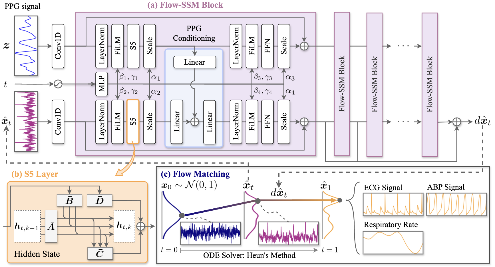

# PENGUIN : General Vital Sign Reconstruction from PPG with Flow Matching State Space Model 🐧 



## 💡 About
This repository provides the implementation of **PENGUIN**, as presented in our paper:
*"PENGUIN : General Vital Sign Reconstruction from PPG with Flow Matching State Space Model "*.
It includes code, dataset preparation instructions, and scripts for training and evaluation.

## 🛠️ Getting Started

### 1: Installation
Clone the repository and set up the environment:
```bash
git clone git@github.com:Neurogica/PENGUIN.git
cd ./PENGUIN
uv init
uv venv
source .venv/bin/activate
uv sync
```

### 2: Data Preparation
Create the folder `./data/rawdata/{dataset_name}` and place the corresponding dataset files inside it.\
You can manually download the datasets from the following sources:
- PPG-DaLiA: https://archive.ics.uci.edu/dataset/495/ppg+dalia
- WildPPG: https://polybox.ethz.ch/index.php/s/NWTuyNojU7aya1y 
- BIDMC: https://physionet.org/content/bidmc/1.0.0/ 
- WESAD: https://ppg-beats.readthedocs.io/en/stable/datasets/wesad/ 
- UCI-BP: https://archive.ics.uci.edu/dataset/340/cuff+less+blood+pressure+estimation 
- MIMIC-BP: https://dataverse.harvard.edu/dataset.xhtml?persistentId=doi:10.7910/DVN/DBM1NF

The directory structure should look like the following example (for WildPPG):
```bash
.
└── data
    └── rawdata
        └── WildPPG
            ├── github_image.zip
            ├── WildPPG_Part_an0.mat
            ├── WildPPG_Part_e61.mat
            ├── WildPPG_Part_fex.mat
            └── ...
```

## 📊 Experiments
To run experiments, first preprocess the dataset using `./src/preprocess.py`, then train the model using `./src/training.py`.\
Detailed configs are provided in `./configs/`.

```bash
# Running on PPG-DaLiA
python ./src/preprocess.py preprocess.dataset=PPG-DaLiA
python ./src/training.py train.dataset=PPG-DaLiA train.model=PENGUIN
```

## ⚙️ Acknowledgment
We gratefully acknowledge the following GitHub repositories for providing valuable code and resources that contributed to this work:

- RDDM (https://github.com/DebadityaQU/RDDM)
- RespDiff (https://github.com/MYY311/RespDiff)
- s5-pytorch (https://github.com/i404788/s5-pytorch)

## 📄 License
This work is licensed under the BSD-3-Clause-Clear License. To view a copy of this license, see [LICENSE](LICENSE).
